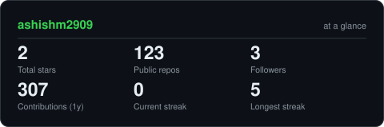

<div align="center">

<!-- PORTRAIT - generated by scripts/dotify.py from assets/jacket.png.
     Colour mode, so one file serves both GitHub themes. Regenerate with:
       python scripts/dotify.py assets/jacket.png -o assets/portrait \
         --cols 100 --equalize --detail 0.5 --color -->


<br>

<!-- NAME / TAGLINE - animated typing -->
<a href="https://github.com/ashishm2909">
  
</a>

<br>

<!-- SOCIALS -->
<a href="https://www.linkedin.com/in/ashish-mishra-5787a1146/"></a>
<a href="mailto:i.m.ashishhh@gmail.com"></a>
<a href="https://ashishmishrafolio.pythonanywhere.com"></a>


</div>

---

## `~/` whoami

```console
$ cat about.txt
```

I’m **Ashish S. Mishra**, a Software Developer focused on Python, Django, backend development, REST APIs,
cloud applications, AI research, and data analytics. I build reliable, scalable web solutions with Django,
Flask, DRF, SQL, Docker, AWS, Git, Linux, JavaScript, HTML, and CSS.

- Currently building **AI-based projects and more**
- Portfolio: **[ashishmishrafolio.pythonanywhere.com](https://ashishmishrafolio.pythonanywhere.com)**
- Advancing in **AI, Machine Learning, Generative AI, LLMs, chatbots, data engineering, MLOps, cloud-native microservices, Kubernetes, DevOps, and intelligent automation**
- Currently learning **advanced AI agent harnessing and loops**

<br>

<div align="center">

## `~/` toolbox


</div>

---

<div align="center">

## `~/` skill radar

<table>
<tr>
<td width="50%" align="center" valign="middle">

<!-- Self-rated radar - edit assets/skills.json, the workflow redraws it -->
<picture>
  <source media="(prefers-color-scheme: dark)"  srcset="assets/radar-dark.svg">
  <source media="(prefers-color-scheme: light)" srcset="assets/radar-light.svg">
  
</picture>

</td>
<td width="50%" align="center" valign="middle">

<!-- Project Focus Radar - curated from your public repositories -->
<picture>
  <source media="(prefers-color-scheme: dark)"  srcset="assets/radar-langs-dark.svg">
  <source media="(prefers-color-scheme: light)" srcset="assets/radar-langs-light.svg">
  
</picture>

</td>
</tr>
</table>

</div>

---

<div align="center">

## `~/` contribution calendar

<!-- 3D isometric calendar, regenerated every 6h by .github/workflows/metrics.yml -->


<br><br>

<!-- Snake eats the contribution graph - .github/workflows/snake.yml -->
<picture>
  <source media="(prefers-color-scheme: dark)"  srcset="https://raw.githubusercontent.com/ashishm2909/ashishm2909/output/snake-dark.svg?v=2">
  <source media="(prefers-color-scheme: light)" srcset="https://raw.githubusercontent.com/ashishm2909/ashishm2909/output/snake.svg?v=2">
  
</picture>

</div>

---

<div align="center">

## `~/` the numbers

<!-- Generated by scripts/cards.py into this repo. Deliberately NOT
     github-readme-stats / streak-stats / github-profile-trophy: those are
     shared public instances that go down and take the whole section with them. -->
<picture>
  <source media="(prefers-color-scheme: dark)"  srcset="assets/card-stats-dark.svg">
  <source media="(prefers-color-scheme: light)" srcset="assets/card-stats-light.svg">
  
</picture>

<br>


<br><br>


</div>

---

<div align="center">

## `~/` selected work

I’m currently building AI-based projects and backend systems. Featured repositories and live demos will be added here as they are finalized.

</div>

---

<div align="center">

<sub>`01110100 01101000 01100001 01101110 01101011 01110011 00100000 01100110 01101111 01110010 00100000 01110011 01100011 01110010 01101111 01101100 01101100 01101001 01101110 01100111`</sub>

</div>
